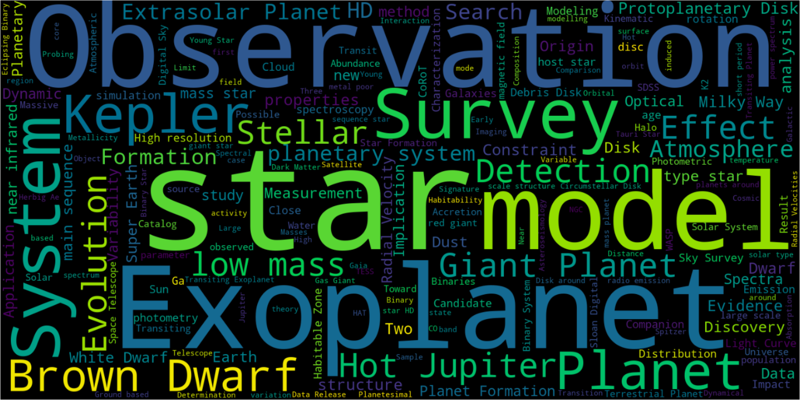
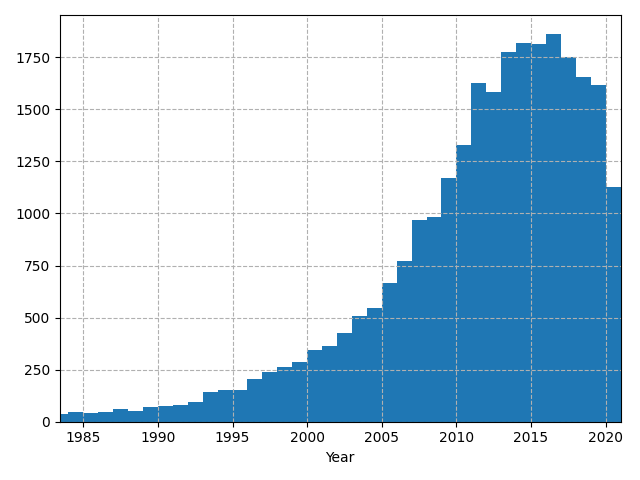

# Exo-Machina
A deep language model, GPT-2, is trained on scientific manuscripts from NASA's Astrophysical Data System pertaining to extrasolar planets and the references therein. The language model is trained in an unsupervised manner on the abstracts of each article. After training, the model is used to generate new sequences of text from scratch and from user input. 


Here is a collection of words from the titles of ~27000 exoplanet-related manuscripts:



The abstracts of each article are used as training samples for the [GPT-2](https://openai.com/blog/better-language-models/) language model. Training is done in an unsupervised manner to learn correlations in scientific language that can later be used for generating text. A few generated samples are below: 

```
Prolonged photometric monitoring is essential for reliable statistics on the distribution of stars between the galaxy and galactic plane. The standard methods for measuring the mean distribution of stars in the Galaxy are: the stellar mean spectrum, high-resolution spectrographs, and the radial distribution distribution of stars. These methods are effective, but there are a variety of other methods that are feasible: spectra with a large signal-to-noise ratio, long-fiber-line photometry, or multiple-wavelength arrays. Here, we show for the first time a method for measuring the galaxy mean spectrum using the full high-resolution spectroscopy at a distance of 1 kpc from the Galactic plane. The method is based on a Bayesian approach, which incorporates the galaxy luminosity function, the mean stellar distance, and the galaxy colour distribution. This yields accurate galaxy abundances for a wide range of star-forming galaxies in the 3.8-13 kpc distance range. Using the technique we achieve stellar abundances close to those derived by spectropolarimetric methods. This is achieved by means of anisotropic selection of galactic haloes. 
```

```
Abundance of helium and/or hydrogen in the gas phase is expected to be the primary cause of the main flow of hydrogen in the turbulent envelope of a planetary system. However, the observational data present in the literature are not consistent with predictions of these predictions. To assess the impact of the orbital eccentricity and non-ideal conditions on the observed binary-planet system, we compare the orbital characteristics of the binary with the dynamical parameters of the host star. We find that the system is strongly influenced by the degree of eccentricity perturbations due to the non-ideal configuration, but as a result, it is not equally affected by the eccentricity perturbations. We conclude that the main flow of hydrogen is affected by the eccentricity perturbations and the orbital eccentricities of the pre-main sequence, but the non-ideal configuration and non-ideal conditions are also different.
```

The language model is also capable of generating sequences from user input: 
```json
Input: The infrared atmospheres of transiting exoplanets
Output:

```
## Setup a SQL Databse to store training samples
A postegres SQL database is set up on Amazon RDS in order to provide online access to the same data for multiple computers. Follow the instructions below to set up your own database using the Free Tier of services on AWS: 

1. sign in or register: https://aws.amazon.com/
2. Search for a services and go to RDS 

Add your credentials to a new file called `settings.json` like such:
```
{
    "database":{
        "dialect":"postgresql",
        "username":"readonly",
        "password":"readonly",
        "endpoint":"exomachina.c4luhvcn1k1s.us-east-2.rds.amazonaws.com",
        "port":5432,
        "dbname":"exomachina"
    }
}
```

## Scraping NASA ADS

https://ads.readthedocs.io/en/latest/

Scrape ADS and save entries into a sql database: 

`python ads_query.py -s settings.json -q exoplanet`

```
usage: ads_query.py [-h] [-q QUERY] [-s SETTINGS] [-k KEY]

optional arguments:
  -h, --help            show this help message and exit
  -q QUERY, --query QUERY
                        Initial search criteria
  -s SETTINGS, --settings SETTINGS
                        Settings file
  -k KEY, --key KEY     Settings key
```

Letting the scrape run for ~2 hours found articles from these publications in descending order:
```
 7187 - The Astrophysical Journal
 4102 - Astronomy and Astrophysics
 3954 - Monthly Notices of the Royal Astronomical Society
 1734 - The Astronomical Journal
 822 - arXiv e-prints
 524 - The Astrophysical Journal Supplement Series
 519 - Icarus
 470 - Publications of the Astronomical Society of the Pacific
 356 - Physical Review D
 311 - Nature
 273 - Journal of Cosmology and Astroparticle Physics
 214 - Science
 193 - Journal of Geophysical Research
 180 - Astronomische Nachrichten
 143 - Journal of Quantitative Spectroscopy and Radiative Transfer
```

The number of manuscripts for each year: 


## Pre-processing
Extract abstracts from the database and create a new file where each line is an new sample. 

`python make_training.py`

## Language Model Optimization

Here is a great resource for learning how to train the GPT-2 model for free using Google Collab: 
https://colab.research.google.com/drive/1AwnFTGzqvGNFxfhwfWo6cVbwEFOiAfrl#scrollTo=H7LoMj4GA4n_

Browse results on our [website]()


## Things to improve
- bigger language model (355M + 10000 steps was used here)
- supervised training on sentances with references
- extract text from manuscript PDF
- more training samples (currently 26569 abstracts)