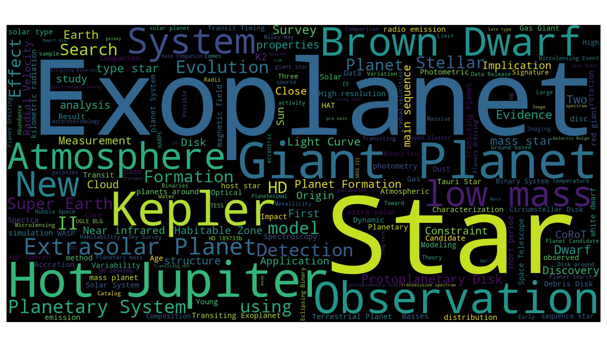

A semantic search engine for white papers on the [ArXiv](https://arxiv.org/) and [NASA ADS](https://ui.adsabs.harvard.edu/). Semantic search uses different techniques to understand the intent and context of search terms. This means that the search engine will understand the meaning of the query beyond just the exact keywords. The search engine uses a language model to generate embeddings for each manuscript which can be clustered for visualization applications and queried for entity searches. The embeddings are generated using [tfidf](https://scikit-learn.org/stable/modules/generated/sklearn.feature_extraction.text.TfidfVectorizer.html)+PCA and a Llama2-based fine tuned model. The embeddings are then clustered using an approximate nearest neighbor technique (ANNOY) or queried with FAISS to provide recommendations on similar articles.

## Dependencies

Create a new virtual environment 

    conda create -n nlp python=3.11
    conda activate nlp
    
Install dependencies 
    
    conda install -c conda-forge spacy
    
    pip install https://s3-us-west-2.amazonaws.com/ai2-s2-scispacy/releases/v0.5.1/en_core_sci_sm-0.5.1.tar.gz

    pip install transformers sqlalchemy sqlalchemy_utils pyuser_agent tqdm ipython jupyter datasets ftfy clean-text unidecode annoy scikit-learn ads

Check out the file: [requirements.txt]() for a list of dependencies and versions

## Set up + Database

1. Create a SQL database to store articles in: 

    `python database.py`

2. Populate the databasae

    a. Download ~2.3 million abstracts from the [Arxiv](https://arxiv.org/) on [Kaggle](https://www.kaggle.com/datasets/Cornell-University/arxiv). After downloading and unzip, run the script: `json2db.py`. Specific categories can be selected by editing the `category_map` dict in the script.

    b. Or, use our query script for manuscripts in [NASA Astrophysical Database](https://ui.adsabs.harvard.edu/). Query the database for abstracts based on a keyword search. See `query_ads.py -h` for more details. You will need to sign up for an account on ADS and subscribe for an API key.

These data are added to a SQL database called `whitepapers.db` which can be sorted and queried in a quick manner using SQL commands or with our SQL wrapper in `database.py`.

3. Remove incomplete entries, convert special characters and remove abstracts based on keywords to clean up the database. 
    
    `python clean_db.py` 

4. Create embeddings and set up an approximate nearest neighbor tree for the database. 

    `python db_to_vec.py`

    We use two different algorithms to generate embeddings, the first is a TF-IDF vectorizer with PCA dimensionality reduction and the second is a fine-tuned language model, [llama2](https://huggingface.co/TheBloke/Speechless-Llama2-Hermes-Orca-Platypus-WizardLM-13B-GGUF). The embeddings are then clustered using an approximate nearest neighbor technique (ANNOY) and queried with FAISS to provide recommendations on similar articles to an input prompt.

## RESTful API

Create a webserver to access the generative model for a predictive keyboard and to be able to find similar abstracts in real time
1. check: `api.py`
2. `uvicorn api:app --reload`

## Examples

Text generation and nearest neighbor recommendations in a single app:

`python -m bokeh serve --show bokeh_example.py`

## Upload to iOS

`python gpt2_to_coreml.py`

## Training GPT-2

A deep language model, GPT-2, is trained on scientific manuscripts from [ArXiv](https://arxiv.org/). This pilot study uses abstracts from ~2.1M articles as training data in order to explore correlations in scientific literature from a language modelling perspective. A language models are algorithms used to generate sequences of numers that correspond to tokens or words and can be used to represent sentances. The text samples are fed into the [GPT-2](https://openai.com/blog/better-language-models/) 117M and trained for ~500,000 steps with fine tuning. After training, the language model is used to generate embeddings for each manuscript which can be clustered for visualization applications and queried for entity searches.

- ### [View on Hugging Face API](https://huggingface.co/pearsonkyle/gpt2-arxiv?text=We+can+remotely+sense+an+atmosphere+by+observing+its+reflected%2C+transmitted%2C+or+emitted+light+in+varying+geometries.+This+light+will+contain+information+on+the+planetary+conditions+including)

### Get started fast:

```python
from transformers import pipeline

ai = pipeline('text-generation',model='pearsonkyle/gpt2-arxiv', tokenizer='gpt2', config={'max_length':1600})
machina = lambda text: ai(text)[0]['generated_text']
```

A few generated samples are below: 

- *We can remotely sense an atmosphere by observing its reflected, transmitted, or emitted light in varying geometries. This light will contain information on the planetary conditions including* `temperature, pressure, composition, and cloud optical thickness. One such property that is important is...`
- *The reflectance of Earth's vegetation suggests*
`that large, deciduous forest fires are composed of mostly dry, unprocessed material that is distributed in a nearly patchy fashion. The distributions of these fires are correlated with temperature, and also with vegetation...`
- *Directly imaged exoplanets probe* `key aspects of planet formation and evolution theory, as well as atmospheric and interior physics. These insights have led to numerous direct imaging instruments for exoplanets, many using polarimetry. However, current instruments take`



Interested in training this model in the cloud? Try this repo on [Google Colab](https://colab.research.google.com/drive/1Pur0rFi5YVdn7axYRacXWFMic4NxRexV?usp=sharing)

1. `python train.py` to train a GPT-2 model, will have to make a script to write the abstracts to a txt file first