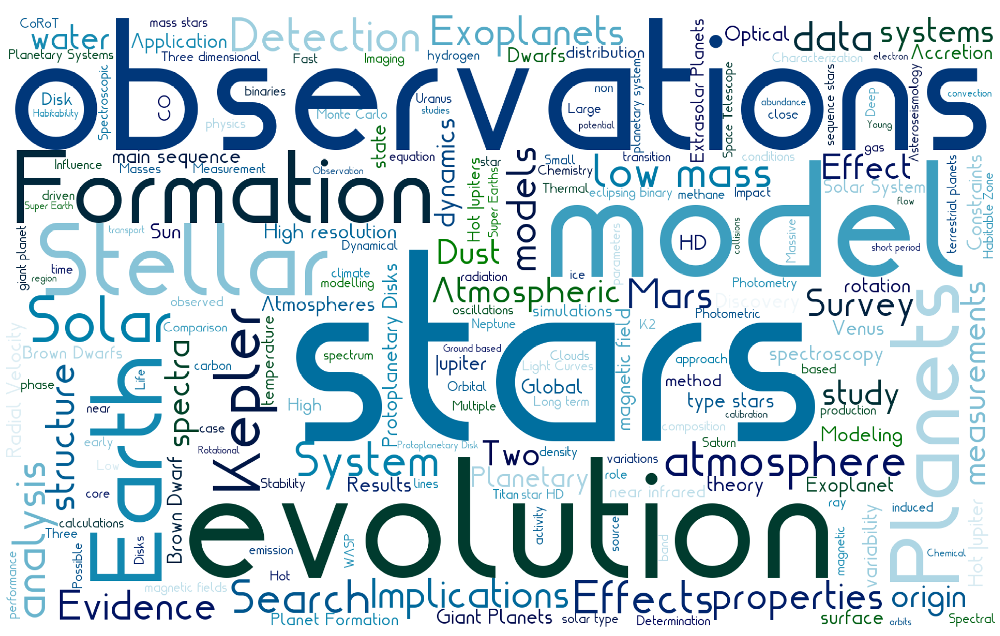
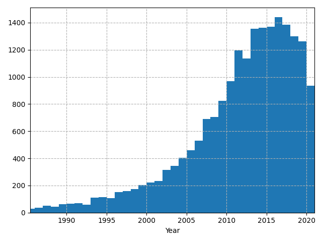

# Exo-Machina
A deep language model, GPT-2, is trained on scientific manuscripts from NASA's Astrophysical Data System pertaining to extrasolar planets and the references therein. This pilot study uses the abstracts of each article as training data in order to explore correlations in scientific literature from a language perspective. A language model is a mathematical representation for an algorithm used to generate sequences in the same way a human would to form sentances. Each word or letter in a sentance is encoded to a numerical value (e.g. using word2vec) and is appended to a list forming sequences that represent up to a paragraph worth of text. The sequences are fed into the [GPT-2](https://openai.com/blog/better-language-models/) 117M model and trained for 500,000 steps with fine tuning. After training, the language model is used to generate new text from scratch and from user input. 

- ### [View on Hugging Face API](https://huggingface.co/pearsonkyle/gpt2-exomachina?text=We+can+remotely+sense+an+atmosphere+by+observing+its+reflected%2C+transmitted%2C+or+emitted+light+in+varying+geometries.+This+light+will+contain+information+on+the+planetary+conditions+including)

- ### [Train your own model on Google Colab](https://colab.research.google.com/drive/1Pur0rFi5YVdn7axYRacXWFMic4NxRexV?usp=sharing)

- ### Try it for [iOS](https://apps.apple.com/us/app/exo-machina/id1542390138)

### Get started fast:

```python
from transformers import pipeline

machina = pipeline('text-generation',model='pearsonkyle/gpt2-exomachina', tokenizer='gpt2',config={'max_length':1600})

print(machina("Transiting exoplanets are")[0]['generated_text'])
```

## Training Samples
~40,000 Abstracts from NASA's Astrophysical data system (ADS) and ArXiv. 



A few generated samples are below: 

- *We can remotely sense an atmosphere by observing its reflected, transmitted, or emitted light in varying geometries. This light will contain information on the planetary conditions including* `temperature, pressure, composition, and cloud optical thickness. One such property that is important is...`
- *The reflectance of Earth's vegetation suggests*
`that large, deciduous forest fires are composed of mostly dry, unprocessed material that is distributed in a nearly patchy fashion. The distributions of these fires are correlated with temperature, and also with vegetation...`
- *Directly imaged exoplanets probe* `key aspects of planet formation and evolution theory, as well as atmospheric and interior physics. These insights have led to numerous direct imaging instruments for exoplanets, many using polarimetry. However, current instruments take`

## Instructions

- ### Setup a SQL Databse to store training samples
A postegres SQL database is set up on Amazon RDS in order to provide online access to the same data for multiple computers. Follow the instructions below to set up your own database using the Free Tier of services on AWS: 

1. sign in or register: https://aws.amazon.com/
2. Search for a services and go to RDS 

Add your credentials to a new file called `settings.json` like such:
```
{
    "database":{
        "dialect":"postgresql",
        "username":"readonly",
        "password":"readonly",
        "endpoint":"exomachina.c4luhvcn1k1s.us-east-2.rds.amazonaws.com",
        "port":5432,
        "dbname":"exomachina"
    }
}
```

## Scraping NASA ADS

https://ads.readthedocs.io/en/latest/

Scrape ADS and save entries into a sql database: 

`python ads_query.py -s settings.json -q exoplanet`

```
usage: ads_query.py [-h] [-q QUERY] [-s SETTINGS] [-k KEY]

optional arguments:
  -h, --help            show this help message and exit
  -q QUERY, --query QUERY
                        Initial search criteria
  -s SETTINGS, --settings SETTINGS
                        Settings file
  -k KEY, --key KEY     Settings key
```

Letting the scrape run for ~2 hours found articles from these publications in descending order:
```
 5364 - The Astrophysical Journal
 3365 - Astronomy and Astrophysics
 2704 - Monthly Notices of the Royal Astronomical Society
 1355 - The Astronomical Journal
 617 - arXiv e-prints
 498 - Icarus
 388 - Publications of the Astronomical Society of the Pacific
 324 - The Astrophysical Journal Supplement Series
 245 - Nature
 187 - Journal of Geophysical Research
 167 - Science
 145 - Astronomische Nachrichten
 129 - Planetary and Space Science
 114 - Space Science Reviews
 109 - Geophysical Research Letters
```

The number of manuscripts for each year: 


## Pre-processing
Extract abstracts from the database and create a new file where each line is an new sample. Try a new tokenizer

## Things to improve

## Export the models to an iOS application


References
- https://huggingface.co/roberta-base 
- GPT-2 generative text
- https://huggingface.co/docs
- https://huggingface.co/transformers/training.html
- https://huggingface.co/transformers/notebooks.html
https://colab.research.google.com/drive/1vsCh85T_Od7RBwXfvh1iysV-vTxmWXQO#scrollTo=ljknzOlNoyrv
http://jalammar.github.io/illustrated-gpt2/
